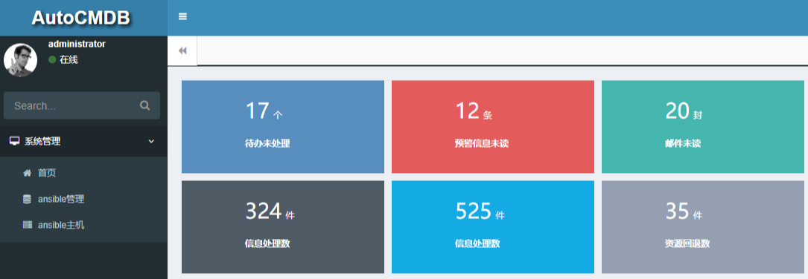

## cmdb/运维管理系统

#### 说明:此cmdb 为dmdb demo类源代码，使用ansible、salt做数据收集与统计.（本系统使用的是ansible来做的数据收集）
###### 注意事项：客户端如需要通过cmdb系统收集完毕系统并能监控则需要默认python2.7环境之外还需要安装python 3.5环境
#### 服务器端安装

1.安装python3.6（如系统环境已经安装请忽略此步骤）
```textmate
wget https://www.python.org/ftp/python/3.6.3/Python-3.6.3.tgz
tar zxvf Python-3.6.3.tgz
cd Python-3.6.3
./configure --prefix=/usr/local/python3.6
make
make install
ln -s /usr/local/python3.6/bin/python3.6 /usr/bin/python3.6
```
2.安装python相关组件
```textmate
pip3.6 install django
pip3.6 install djangorestframework
pip3.6 install ansible
```


#### 客户端安装/资源收集端
1.安装python3.6（如系统环境已经安装请忽略此步骤）
```textmate
wget https://www.python.org/ftp/python/3.6.3/Python-3.6.3.tgz
tar zxvf Python-3.6.3.tgz
cd Python-3.6.3
./configure --prefix=/usr/local/python3.6
make
make install
ln -s /usr/local/python3.6/bin/python3.6 /usr/bin/python3.6
```
#### 截图展示


